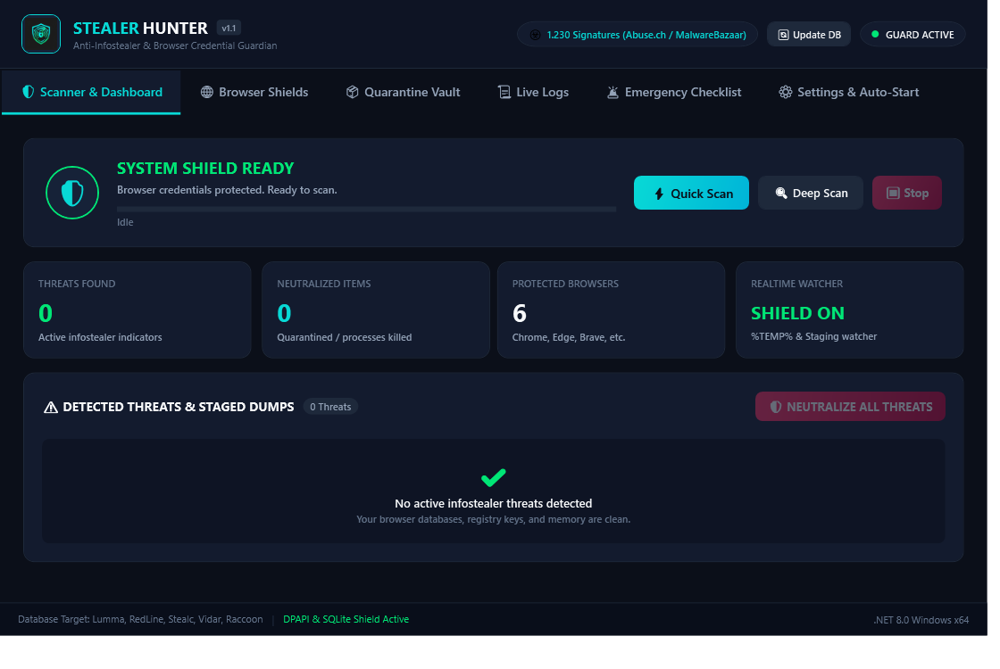
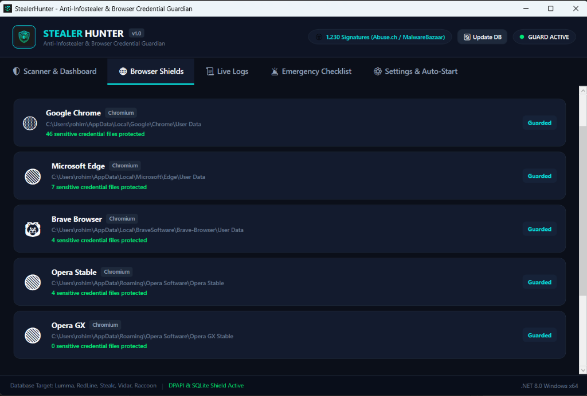
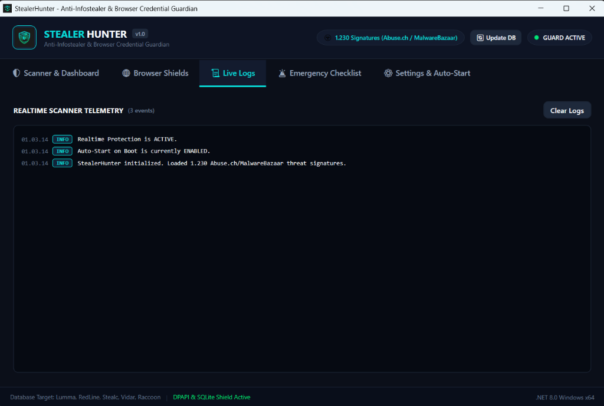
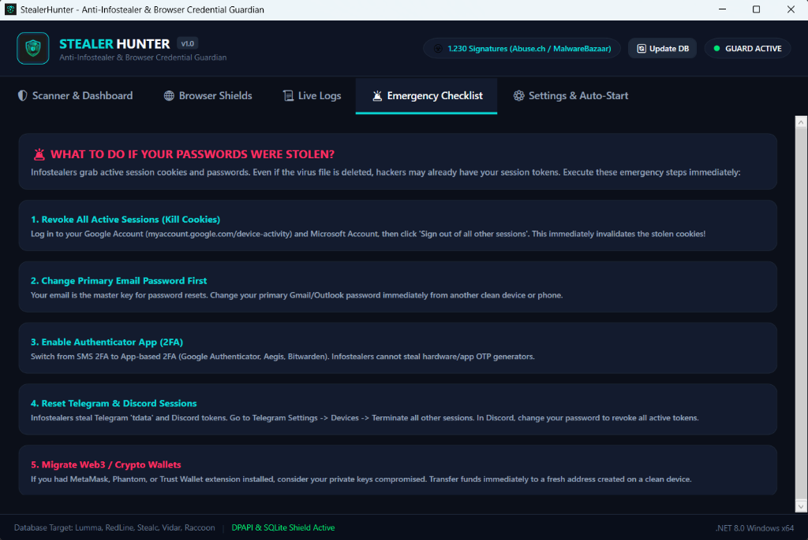
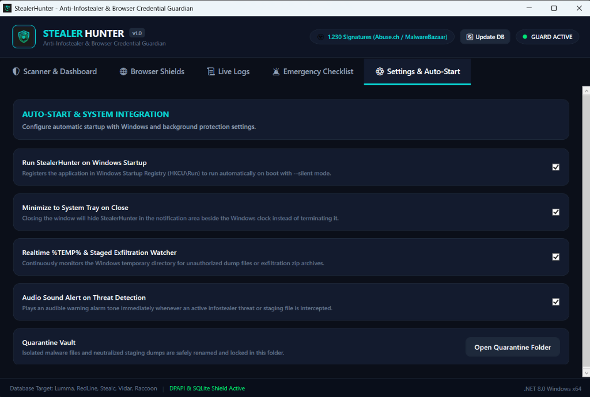

# 🛡️ StealerHunter: Anti-Infostealer & Browser Credential Guardian

[](https://microsoft.com)
[](https://dotnet.microsoft.com/)
[](#)
[](#)
[](#)

**StealerHunter** adalah aplikasi desktop keamanan modern berbasis **C# (.NET 8 WPF)** yang dirancang khusus untuk memburu, menghentikan, dan membersihkan malware pencuri kata sandi (**Infostealer**) seperti **Lumma Stealer, RedLine, Stealc, Vidar, dan Raccoon**, serta mengamankan basis data kredensial dan *session cookies* peramban (browser).

<p align="center">
  
</p>

---

## 📸 Antarmuka Aplikasi (User Interface)

<details open>
<summary><b>Klik untuk melihat pratinjau lengkap antarmuka StealerHunter</b></summary>
<br/>

### 1. 🛡️ Scanner & Dashboard Utama
Ringkasan status pertahanan real-time, lencana signature intelijen Abuse.ch MalwareBazaar, status peramban terproteksi, serta kontrol pemindaian cepat (*Quick Scan*) dan mendalam (*Deep Scan*).
<p align="center">
  
</p>

### 2. 🌐 Browser Vault Integrity Shield
Pemantauan dan perlindungan integritas berkas kredensial (*Login Data, Cookies, Web Data, Local State*) untuk Google Chrome, Microsoft Edge, Brave, Opera Stable, dan Opera GX.
<p align="center">
  
</p>

### 3. 📜 Telemetri & Live Logs
Log pemindaian real-time memantau status pemuatan database hash dan aktivitas latar belakang sistem.
<p align="center">
  
</p>

### 4. 🚨 Emergency Security Checklist
Panduan tindakan darurat pasca-infeksi: pencabutan sesi web aktif (*Revoke Google/Microsoft sessions*), pergantian master email password, aktivasi 2FA, dan isolasi crypto wallet.
<p align="center">
  
</p>

### 5. ⚙️ Settings & Auto-Start Configuration
Pengaturan integrasi sistem Windows: pendaftaran autorun saat booting (dengan mode *silent*), minimize ke system tray pojok kanan bawah, dan watcher folder `%TEMP%`.
<p align="center">
  
</p>

</details>

---

## 🎯 Mengapa Dikhususkan untuk Infostealer?
Infostealer memiliki karakteristik serangan cepat berantai (*hit-and-run*):
1. **Menyerang Berkas Kredensial Browser**: Menyasar database SQLite (`Login Data`, `Cookies`, `Web Data`, `Local State`).
2. **Mengekstrak Kunci Windows DPAPI**: Membaca kata sandi tersimpan dan token sesi login akun.
3. **Mencuri Sesi Aplikasi**: Mengambil token Discord, file sesi Telegram (`tdata`), dan *crypto wallet extension*.
4. **Staging & Eksfiltrasi**: Mengumpulkan data curian ke folder `%TEMP%` atau `%APPDATA%` lalu mengunggahnya ke server C2 / bot Telegram pelaku.

**StealerHunter** memutus rantai serangan ini secara langsung dari akarnya.

---

## 🚀 Fitur Utama

1. **Auto-Start with Windows & System Tray Guard**:
   * Opsi toggle **"Run on Windows Startup"** (`HKCU\Software\Microsoft\Windows\CurrentVersion\Run`).
   * Mode **Silent Boot**: Berjalan otomatis di latar belakang tanpa memunculkan jendela besar yang mengganggu saat Windows menyala.
   * **Minimize to System Tray**: Bersembunyi di area notifikasi pojok kanan bawah dengan menu konteks klik kanan.
   * **Boot Quick Scan**: Pemindaian otomatis seketika saat komputer dinyalakan.

2. **Realtime %TEMP% & Staging Watcher (64KB Buffer & Shannon Entropy Engine)**:
   * **Shannon Entropy Analysis**: Menghitung tingkat keacakan (*entropy*) berkas baru di folder `%TEMP%`. Berkas teks normal memiliki entropi 3.0–5.0; berkas hasil enkripsi/obfuscation malware (seperti Lumma/Stealc) yang disamarkan sebagai `.txt`, `.tmp`, atau `.dat` dengan entropi tinggi (≥ 7.15) akan langsung terdeteksi sebagai muatan eksfiltrasi curian.
   * **Buffer Kapasitas Tinggi 64 KB**: Mencegah terjadinya *InternalBufferOverflowException* saat aktivitas berkas sistem sedang padat.
   * Memergoki pembuatan file dump curian (`passwords.txt`, `cookies.txt`, `wallets`, atau arsip zip mencurigakan).

3. **Browser Vault Integrity Shield**:
   * Memeriksa integritas database kredensial untuk **Google Chrome, Microsoft Edge, Brave, Mozilla Firefox, Opera Stable, Opera GX, dan Vivaldi**.
   * Mendeteksi penguncian berkas (*file lock*) mencurigakan oleh program asing di saat browser sedang ditutup.

4. **Process & Memory Hunter (Digital Signature & PPID Verification)**:
   * **Parent Process ID (PPID) Integrity (MITRE ATT&CK T1036/T1055)**: Memverifikasi keabsahan rantai induk-anak proses Windows (contoh: `svchost.exe` wajib berinduk pada `services.exe`). Jika `svchost.exe` dipicu oleh `cmd.exe`, `powershell.exe`, atau aplikasi asing, sistem langsung menandainya sebagai *Process Masquerading/Spoofing*.
   * **Validasi Tanda Tangan Digital Resmi (X509 / Authenticode)**: Memverifikasi sertifikat digital vendor terpercaya (Microsoft, Google, Acer, NVIDIA, Valve, dll.) untuk meniadakan *false positive* pada updater resmi.
   * **Isolasi Berkas Unsigned/Tanpa Sertifikat**: Memindai dan menandai proses asing tanpa tanda tangan digital yang berjalan dari lokasi berisiko (`%TEMP%`, `%APPDATA%`, `Downloads`, `Public`).
   * Mendeteksi eksekusi skrip tersembunyi (PowerShell `-w hidden -enc`, skrip obfuscated).

5. **Persistence & Autorun Hunter**:
   * Memeriksa entri autorun di Registry (`HKCU` & `HKLM` `Run` / `RunOnce`).
   * Memeriksa entri Task Scheduler dan Windows Startup dari skrip atau executable asing.

6. **One-Click Neutralize & Quarantine**:
   * Mematikan seluruh pohon proses malware seketika (*Process Tree Termination*).
   * Mengisolasi file berbahaya ke folder karantina aman (`%APPDATA%\StealerHunter\Quarantine`).
   * Menghapus entri autorun dan service jahat dari registry secara bersih.

7. **Emergency Security Checklist**:
   * Panduan langkah darurat pasca-infeksi: pencabutan sesi web aktif (*Revoke Google/Microsoft sessions*), pergantian password master email, aktivasi 2FA aplikasi, dan pengamanan aset digital.

8. **Dual-Engine Threat Intelligence (Abuse.ch MalwareBazaar Integration)**:
   * **1,230+ Hash Signatures**: Terintegrasi langsung dengan database signature ancaman global dari **Abuse.ch MalwareBazaar**.
   * **Rate-Limit (HTTP 429) Failover & Backoff**: Mekanisme penanganan pembatasan frekuensi dengan peralihan endpoint otomatis (*endpoint failover*) dan jeda *backoff*.
   * **Thread-Safe Chunk-Based Loading**: Pemuatan streaming data bertahap (*chunking*) untuk menjaga antarmuka pengguna (UI) tetap 100% responsif tanpa *freeze*.
   * **Live Threat DB Updater**: Fitur pembaruan daring (*Live Update*) sekali klik untuk mengunduh intelijen malware teranyar dari server siber.
   * **Memory & Directory Hash Matching**: Memvalidasi hash SHA-256 seluruh proses aktif dan direktori berisiko tinggi dengan pencarian instan O(1).

---

## 💻 Cara Menggunakan & Instalasi

### 1. Menggunakan File Installer (Rekomendasi Pengguna)
Unduh file **`StealerHunter_Setup.exe`** dari menu [Releases](https://github.com/rohimat12/stealer-hunter/releases), jalankan installer, dan aplikasi siap melindungi sistem Anda.

### 2. Mode Darurat Tanpa GUI (Batch Script)
Jika sistem Anda sedang dalam infeksi aktif dan butuh pembersihan cepat seketika:
Jalankan file **`BERSIHKAN_VIRUS.bat`** dengan **Run as Administrator**.

### 3. Menjalankan dari Source Code (Developer):
Pastikan .NET 8 SDK sudah terpasang, lalu jalankan:
```powershell
dotnet run --project StealerHunter
```

### 4. Mem-build File Executable Mandiri (.exe Tunggal):
```powershell
dotnet publish StealerHunter -c Release -r win-x64 --self-contained true -p:PublishSingleFile=true -o ./dist
```

### 5. Mem-build File Installer (Inno Setup):
Jalankan skrip pembangun:
```cmd
BUILD_INSTALLER.bat
```

---

## 🧪 Pengujian Unit (Unit Tests)
Proyek ini dilengkapi pengujian otomatis (MSTest):
```powershell
dotnet test
```
*Seluruh pengujian unit (7/7) terverifikasi sukses.*

---

## 🛠️ Struktur Proyek

```
stealer-hunter/
├── StealerHunter.sln            # Visual Studio / .NET Solution
├── StealerHunter_Setup.iss      # Skrip Inno Setup Installer
├── BERSIHKAN_VIRUS.bat          # Skrip darurat pembersihan sistem
├── BUILD_INSTALLER.bat          # Otomasi kompilasi installer
├── README.md                    # Dokumentasi proyek
├── StealerHunter/               # Proyek Aplikasi Utama (C# WPF .NET 8)
│   ├── Models/                  # ThreatItem, BrowserTarget, ScanLogItem, AppSettings
│   ├── Services/                # BrowserAudit, ProcessHunter, Persistence, Quarantine, AutoStartup, RealtimeWatcher, SystemTray, MalwareDatabase
│   ├── ViewModels/              # MainViewModel, RelayCommand, ValueConverters
│   ├── Resources/               # Styles.xaml (Modern Cyber Dark Theme), malware_db.json (Abuse.ch DB)
│   ├── MainWindow.xaml/.cs      # Tampilan UI Dashboard & Tray Integration
│   └── App.xaml/.cs             # Konfigurasi Aplikasi & Resource Dictionary
└── StealerHunter.Tests/         # Proyek Unit Test (MSTest)
```

---

## 👥 Pengembang & Kontribusi

* **Lead Developer**: [@rohimat12](https://github.com/rohimat12)
* **Engineering Workflow**: Dikembangkan bersama menggunakan pendekatan modern **AI Pair Programming** untuk analisis siber dan implementasi sistem.

---

## ⚖️ Disclaimer
Aplikasi ini dibuat murni untuk keperluan pertahanan keamanan (*defensive security*), analisis siber edukatif, dan membantu pembersihan malware pada komputer pengguna. Pengembang tidak bertanggung jawab atas penyalahgunaan atau modifikasi tidak sah dari perangkat lunak ini.
